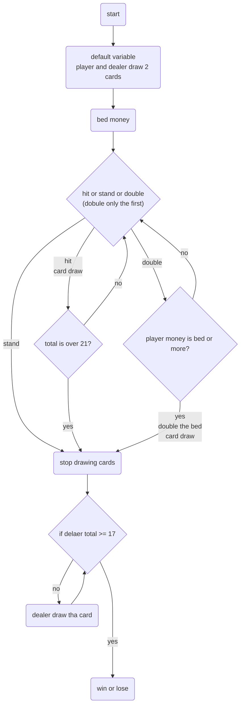

# BlackJack

```mermaid
flowchart TD;

BOF(start) --> initialize
initialize("""
default variable
player and dealer draw 2 cards
""") --> player_bed(bed money)
player_bed --> player_action{"hit or stand or double
(dobule only the first)"}
player_action --> |stand| player_action_stop(stop drawing cards)
player_action --> |"hit
card draw"| player_hit{total is over 21?}
player_action --> |double| player_double{player money is bed or more?}
player_hit --> |yes| player_action_stop
player_hit --> |no| player_action
player_double --> |"yes
double the bed
card draw"| player_action_stop
player_double --> |no| player_action
player_action_stop --> if_delaer_total_over{if delaer total >= 17}
if_delaer_total_over ----> |yes| dealer_drawing_stop(win or lose)
if_delaer_total_over --> |no| delaer_draw(dealer draw tha card)
delaer_draw --> if_delaer_total_over
```
